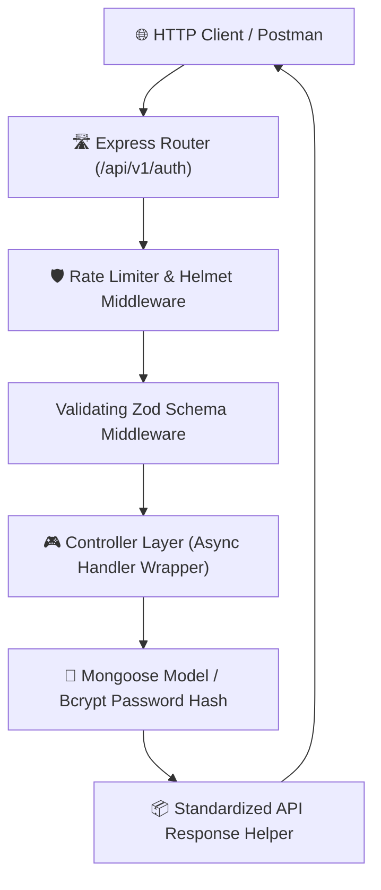

# 🚀 sk-nodeexpress

[](https://www.npmjs.com/package/sk-nodeexpress)
[](https://www.npmjs.com/package/sk-nodeexpress)
[](https://dev.to/shobhit_kumar_f4d8a243152/stop-writing-express-boilerplate-build-a-production-ready-rest-api-in-minutes-1on5)
[](https://opensource.org/licenses/MIT)
[](https://github.com/kumarshobhit-1/create-nodeexpress)

**`sk-nodeexpress`** is an ultra-fast, zero-config CLI generator that instantly scaffolds production-ready Node.js & TypeScript Express backend REST APIs. 

Say goodbye to spending hours writing repetitive Express boilerplate, JWT authentication logic, Zod validation schemas, environment handling, CORS, Helmet security headers, rate limiting, Docker setups, and database connections from scratch!

> 📖 **Featured Article on Dev.to**: [Stop Writing Express Boilerplate: Build a Production-Ready REST API in Minutes](https://dev.to/shobhit_kumar_f4d8a243152/stop-writing-express-boilerplate-build-a-production-ready-rest-api-in-minutes-1on5)


```bash
npx sk-nodeexpress my-app
```

---

## 📌 Table of Contents

- [🚀 Features](#-features)
- [📊 Comparison Table](#-comparison-table)
- [🏗️ Architecture Flow](#️-architecture-flow)
- [📦 Installation](#-installation)
- [⚡ Quick Start & CLI Flags](#-quick-start--cli-flags)
- [📁 Project Structure](#-project-structure)
- [🐳 Docker Support](#-docker-support)
- [🔧 Environment Variables](#-environment-variables)
- [📜 Available Scripts](#-available-scripts)
- [📚 API Example](#-api-example)
- [❓ FAQ & Troubleshooting](#-faq--troubleshooting)
- [🗺️ Roadmap](#️-roadmap)
- [🤝 Contributing](#-contributing)
- [📄 License](#-license)

---

## 🚀 Features

- ⚡ **Express Server Core**: Pre-configured app & server entry point with clean modular architecture.
- 📐 **Dual Language Support**: Choose between **JavaScript (ES Modules)** and **TypeScript**.
- 🛡️ **Zod Payload Validation**: Integrated Zod validation middleware for all authentication endpoints.
- 🔐 **Pre-built JWT Authentication**:
  - User Registration (`POST /api/v1/auth/register`)
  - User Login (`POST /api/v1/auth/login`)
  - Forgot & Reset Password Stubs (`POST /api/v1/auth/forgot-password`, `/reset-password`)
  - Protected User Profile (`GET /api/v1/auth/me`)
  - Password hashing using `bcryptjs`
  - JWT token generation & Verification Middleware
- 🍃 **Database Integration**: MongoDB setup using `mongoose` (User Schema, connection handlers, duplicate key error handling).
- 🐳 **Docker Ready**: Multi-stage `Dockerfile` and `docker-compose.yml` for instant containerization.
- 🛡️ **Production Security & Middlewares**:
  - `helmet`: Protects HTTP headers
  - `cors`: Handles cross-origin requests
  - `express-rate-limit`: Prevents DDoS / Brute-force attacks
  - `morgan`: Request logging
  - `cookie-parser`: Parses cookies safely
  - Global Error Handling & 404 Route Catchers
- 🎯 **Dynamic File Scaffolding**: Strips unused files dynamically based on your selections.

---

## 📊 Comparison Table

| Feature | `sk-nodeexpress` | `express-generator` | `NestJS CLI` |
| :--- | :---: | :---: | :---: |
| **TypeScript Native** | ✅ | ❌ | ✅ |
| **Pre-built JWT Auth** | ✅ | ❌ | ❌ |
| **Zod Input Validation** | ✅ | ❌ | Manual |
| **Docker & Compose Setup**| ✅ | ❌ | Manual |
| **Security (Helmet/RateLimit)** | ✅ | ❌ | Manual |
| **Setup Time** | **< 5s** | ~30s | ~60s |
| **Zero Configuration** | ✅ | ❌ | ❌ |

---

## 🏗️ Architecture Flow



---

## 📦 Installation

No global installation is required! Run directly using `npx`:

```bash
npx sk-nodeexpress
```

Or specify your project name directly:

```bash
npx sk-nodeexpress my-express-api
```

---

## ⚡ Quick Start & CLI Flags

### 1. Interactive Mode (Default)
```bash
npx sk-nodeexpress my-app
```

### 2. Sub-Second Non-Interactive Flags
```bash
# JavaScript + MongoDB + Auth + Docker
npx sk-nodeexpress my-app --yes

# TypeScript + MongoDB + Auth + Docker
npx sk-nodeexpress my-ts-app --ts --auth --docker

# Standalone Express Server without Auth/DB
npx sk-nodeexpress my-minimal-app --js --no-auth --db none --no-docker
```

#### Supported Flags:
- `--ts` / `--js`: Select language template
- `--auth` / `--no-auth`: Include or exclude JWT Authentication
- `--db <type>`: Database type (`mongodb` or `none`)
- `--docker` / `--no-docker`: Include or exclude Docker & docker-compose
- `--install` / `--no-install`: Control automatic `npm install`

---

## 📁 Project Structure


```text
my-express-api/
├── src/
│   ├── config/
│   │   └── db.js            # MongoDB Mongoose Connection
│   ├── controllers/
│   │   ├── authController.js# Register, Login, Profile, Password Reset
│   │   ├── userController.js# User management logic
│   │   └── healthController.js # Server healthcheck endpoint
│   ├── middlewares/
│   │   ├── authMiddleware.js# JWT Guard & Role verification
│   │   ├── validate.js      # Zod Schema Validator Middleware
│   │   ├── errorMiddleware.js# Global Error & 404 handler
│   │   └── rateLimiter.js   # Rate limiting guards
│   ├── validations/
│   │   └── authValidation.js# Zod Validation Schemas
│   ├── models/
│   │   └── User.js          # Mongoose User Schema & Bcrypt methods
│   ├── routes/
│   │   ├── authRoutes.js    # Auth endpoints with Zod Guards
│   │   ├── userRoutes.js    # User endpoints
│   │   └── healthRoutes.js  # Health endpoint
│   ├── utils/
│   │   ├── apiResponse.js   # Standardized JSON response wrapper
│   │   ├── asyncHandler.js  # Async Error Handler Wrapper
│   │   └── jwt.js           # JWT Sign & Verify helpers
│   ├── app.js               # Express application setup
│   └── server.js            # Server listener
├── Dockerfile               # Production Docker Container setup
├── docker-compose.yml       # Express API + MongoDB Services setup
├── .env.example             # Environment template
├── package.json             # App dependencies & npm scripts
└── README.md                # Generated project documentation
```

---

## 🐳 Docker Support


To run your API inside a Docker container with MongoDB:

```bash
# Build and start containers in detached mode
docker-compose up -d --build

# View container logs
docker-compose logs -f

# Stop containers
docker-compose down
```

---

## 🔧 Environment Variables

```env
PORT=5000
NODE_ENV=development
MONGODB_URI=mongodb://localhost:27017/my_sknodejs_db
JWT_SECRET=super_secret_jwt_key_change_in_prod
JWT_EXPIRES_IN=7d
CORS_ORIGIN=*
```

---

## 📚 API Example

### 1. Register User
`POST /api/v1/auth/register`
```json
{
  "name": "Jane Doe",
  "email": "jane@example.com",
  "password": "password123"
}
```

### 2. Login User
`POST /api/v1/auth/login`
```json
{
  "email": "jane@example.com",
  "password": "password123"
}
```

---

## ❓ FAQ & Troubleshooting

### Q: `JWT_SECRET environment variable is missing` error?
Ensure you have created a `.env` file from `.env.example` and specified a valid `JWT_SECRET`.

### Q: MongoDB Connection Refused?
Ensure MongoDB service is running locally (`mongod`) or start it via `docker-compose up -d mongo`.

---

## 🗺️ Roadmap

- [x] **v1.1.0**: Zod Validation, Async Process Execution, Docker Support, Non-interactive Flags.
- [ ] **v1.2.0**: Swagger OpenAPI documentation endpoint (`/api-docs`).
- [ ] **v2.0.0**: Prisma ORM Support (PostgreSQL / MySQL).

---

## 🤝 Contributing

Please read our [Contributing Guide](CONTRIBUTING.md) and [Code of Conduct](CODE_OF_CONDUCT.md) before submitting pull requests.

---

## 📄 License

MIT © [Shobhit Kumar](https://github.com/kumarshobhit-1)
